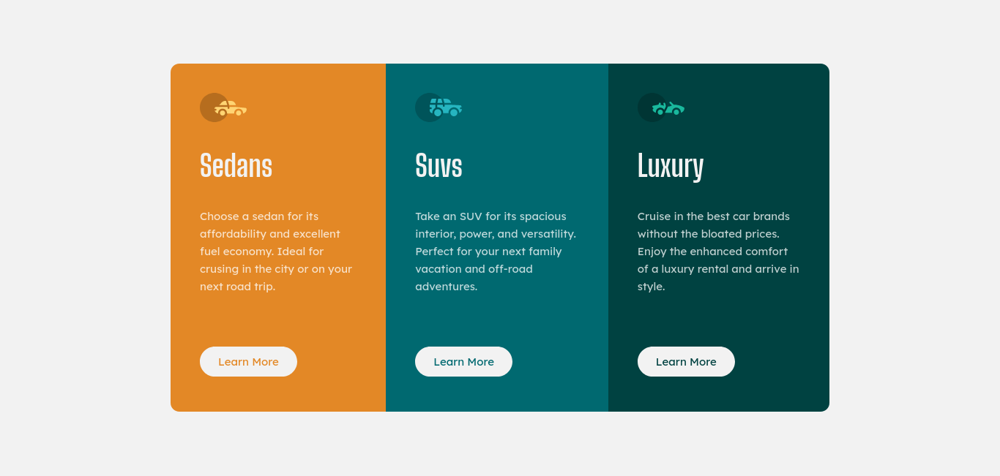
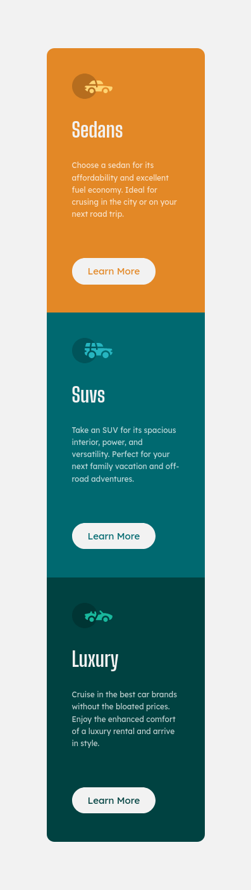

# Frontend Mentor - Solución al componente 3 column preview card

Esta es una solución al [Desafío del componente 3 column preview card en Frontend Mentor](https://www.frontendmentor.io/challenges/stats-preview-card-component-8JqbgoU62).

## Tabla de contenido

- [Visión general](#visión-general)
  - [El reto](#el-reto)
  - [Capturas de pantalla](#capturas-de-pantalla)
  - [Enlaces](#enlaces)
- [Mi proceso](#mi-proceso)
  - [Construido con](#construción)
  - [Lo que aprendi](#lo-que-aprendi)
  - [Desarrollo continuo](#desarrollo-continuo)
  - [Recursos útiles](#recursos-útiles)
- [Autor](#autor)

## Visión general

### El reto

Los usuarios deben ser capaces de:

- Ver el diseño óptimo en función del tamaño de la pantalla de su dispositivo
- Ver los estados hover de los elementos interactivos

### Capturas de pantalla

- Escritorio



- Móvil



### Enlaces

- URL de la solución (Frontend Mentor): [Solución en Frontend Mentor]([https://www.frontendmentor.io/solutions/stats-preview-card-PjU9dh_PHf](https://www.frontendmentor.io/solutions/3columnpreviewcard-gA8b6r6yw6))
- URL del sitio en vivo: [En vivo]([https://boudgnosis.github.io/stats-preview-card/](https://boudgnosis.github.io/3-column-preview-card/))

## Mi Proceso

### Construción

- HTML semántico
- Variables CSS
- Flexbox
- Accesibilidad web
- Media queries 
- Responsive desing
- Efectos hover
- Animación

### Lo que aprendi

Me encontré con un pequeño detalle en el momento de aplicar los efectos del hover que fue cuando quite el background-color y aplique un **border**
este hacía que todo el componente se moviera cuando el mause se posicionaba sobre el botón, aprendí que el border se crea afuera del contenedor haciendo
que aparezca un nuevo espacio entre los demás elementos y afectado su posición en el sitio, la solución que encontré fue agregar outline que este se crea
encima del contenedor sin afectar el resto.

```css
.btn:hover {
	outline: 2px solid var(--Very-light-gray);
}
```

### Desarrollo continuo

Me he encontrado que suelo repetir cierto **estilos CSS** que simplemente podría aplicarse a una clase general para no estar repitiendo tanto y es algo
que a medida que aprendo mis estilos van necesitando menos líneas para hacer lo mismo que hacían antes.

### Recursos útiles

- [MDN Web Docs](https://developer.mozilla.org/es/) - Suelo usar este recurso porque explica muy bien todo además de que tiene una documentación muy amplia.

## Autor

- Codepen - [@boudgnosis](https://codepen.io/boudgnosis)
- Frontend Mentor - [@boudgnosis](https://www.frontendmentor.io/profile/boudgnosis)
- Twitter - [@juan_ariasd](https://twitter.com/juan_ariasd)   
- Dev - [@juan_duque](https://dev.to/juan_duque)
- Linkedink - [juan pablo arias duque](https://www.linkedin.com/in/jpariasduque/)
